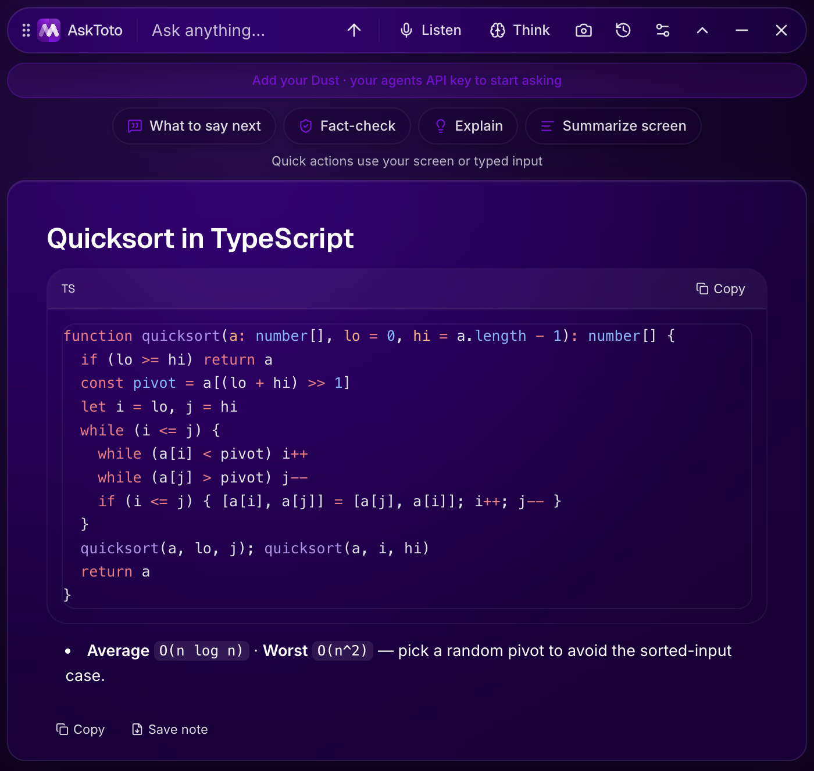

<div align="center">

# Métis

**The wisdom before the moment — your on-device AI meeting copilot.**
A frameless, transparent, always-on-top glass overlay for macOS and Windows.



`18 AI providers (incl. Dust)` · `thinking-mode routing` · `on-device transcription` · `knowledge graph` · `encrypted at rest`

Built by **[Tony Walteur](https://www.linkedin.com/in/tonywalteur/)** · Mantu

</div>

---

## What this is

Métis is an **on-device AI meeting copilot**: a frameless, transparent, always-on-top glass overlay
that floats over every app on macOS and Windows. Look and feel modeled on Cluely, rebuilt from scratch
with Mantu branding and wired to 18 AI providers (Claude, GPT, Gemini, an on-device model, and more),
including Dust as the primary "your own agents" brain.

Three core actions:
- **Ask** — type a question, get a streamed answer (rich markdown, code, tables).
- **Capture** — screenshot the screen, send to a vision model.
- **Listen** — live mic + system-audio transcription, fully on-device (Whisper / Parakeet), real-time
  suggestions. Listen is started manually (hotkey or button) — there is no OS-level meeting detection.

Plus one-click **Fact-check**, **Hide from screen capture**, a visible recording indicator, a
**knowledge graph** of your notes (graphify + the `brain` subsystem, surfaced in-app and in the
separate Mantu Intelligence dashboard), and **transcripts encrypted at rest by default**.

### Naming: Métis vs. `asktoto`

The product is branded **Métis** everywhere a user sees it (window title, installers, docs). The
**package name, internal app id, and most internal identifiers stay `asktoto` on purpose** — they
predate the rebrand and changing them would break macOS TCC permission grants (mic/screen-recording
consent tied to the bundle id) and the electron-updater continuity for existing installs. Expect to see
`asktoto` in `package.json`, `userData` paths, log files, and code comments; that is not a rename bug.

## Install

Grab the installer for your OS from the [Métis releases page](https://github.com/mysticalsin/Metis-Releases/releases):

- **macOS Electron** — `Metis-<version>.dmg` (cross-platform overlay).
- **macOS native** — `Metis-Native-<version>.zip` (SwiftUI / Apple Intelligence; unzip → `Metis.app`).
- **Windows x64** — `Metis-Setup-<version>.exe` (installer) or `Metis-Portable-<version>.exe`
  (no-install; the portable build never auto-updates because electron-updater has no portable-EXE
  support).

Tagged public releases are published only after both native builds pass the signing, package-integrity,
and size gates. If no current release is listed, the external signing/release gates have not completed;
do not substitute an unsigned local build for customer distribution.

All transcription runs on-device; models are bundled (no first-run download).

Full install instructions: [`docs/INSTALL.md`](docs/INSTALL.md).

## Quick start (from source)

Requires **Node 22.22.3 LTS**, pinned consistently in `.nvmrc`, `.node-version`, `package.json`, and CI.

```bash
npm install
npm run dev          # launch the overlay (dev)
npm run typecheck    # tsc, both projects (main + web)
npm test             # vitest (unit + integration)
npm run build        # bundle main + preload + renderer → out/
npm run dist         # package a signed-runtime app → release/ (electron-builder)
npm run installers   # build the installer for this OS and print the installable files
```

The install step provisions and verifies the exact Electron runtime for the build host; this is a
developer/build dependency, not a download required by installed Métis apps. Build, dev, and preview
commands check it without downloading. If dependencies were installed with `--ignore-scripts`, run
`node scripts/ensure-electron-runtime.mjs` explicitly before building. To verify an already-provisioned
runtime offline, use `node scripts/ensure-electron-runtime.mjs --check-only`. Do not reuse `out/`
bytecode after changing the Electron version or build architecture: rebuild it with the new runtime.

Set a provider key in-app: gear → **AI** → paste your key → Save (stored encrypted on-device via
Electron `safeStorage`). Or connect **Dust** (your own agents) with one click from the Dust CLI session.

Two things `npm install` at the repo root does **not** cover:

- **Mantu Intelligence dashboard** (`intelligence/`) is a separate Vite/React workspace with its own
  `package.json`. `npm run dev` still works without it — `openIntelligenceWindow()` returns gracefully
  if `intelligence/dist` is missing — but to open the dashboard itself, run
  `npm run build:intelligence` first (this does `cd intelligence && npm ci && npm run build`).
- **The LGPL ffmpeg sidecar binaries** under `resources/ffmpeg/<platform>-<arch>/` are deliberately
  git-ignored and not fetched by `npm install`; the reviewed hash manifest and LGPL license in the
  directory are tracked. Missing binaries don't break `npm run dev` — only "import audio file" cannot
  decode. See `docs/ENTERPRISE_RELEASE.md`'s ffmpeg sidecar section to provision them locally.

## Script reference

Every script in `package.json`, one line each:

| Script | What it does |
|---|---|
| `dev` | Launch the overlay in dev mode (electron-vite dev) |
| `check:main-imports` | Fail if `src/main/**` uses a dynamic `import()` (breaks under bytecode compilation) |
| `check:ffmpeg` | Verify the reviewed LGPL ffmpeg sidecar binary for the current platform |
| `check:sherpa` | Verify/provision the native Parakeet (sherpa-onnx) addon for the current platform |
| `prebuild` | Runs `check:main-imports` automatically before `build` |
| `build` | Bundle main + preload + renderer (electron-vite build) → `out/` |
| `preview` / `start` | Preview the built app (electron-vite preview) |
| `typecheck` | `tsc --noEmit` for both the node (main/preload) and web (renderer) tsconfigs |
| `test` | Run the vitest suite (`src/**` + `intelligence/src/**`) |
| `test:smoke:import` | Build, then run the packaged-app audio-import smoke test (Playwright) |
| `check:xcode` | Verify Xcode command-line tools are present (macOS signing prerequisite) |
| `check:release-secrets` | Verify required signing secrets/env vars are set for a release target |
| `check:release` | Pre-release gate (version parity, etc.) |
| `verify:signing` | Verify a built app's code signature |
| `fetch-models` | Download bundled ASR model weights (Whisper + Parakeet, ~700MB) |
| `build:intelligence` | `cd intelligence && npm ci && npm run build` — builds the Mantu Intelligence dashboard bundle |
| `installers` / `installers:mac` / `installers:win` / `installers:all` | Build installers for the current OS / mac / win / all platforms |
| `predist` | ffmpeg + sherpa checks (mac) + fetch models + build intelligence, before `dist` |
| `dist` | Package an ad-hoc-signed local macOS app → `release/` (not notarized; no publish) |
| `dist:local` | Local Mac rebuild with ad-hoc signing into an OneDrive-free output dir, then verify it |
| `predist:win` | ffmpeg + sherpa checks (win) + fetch models, before a Windows dist |
| `dist:win` | Fetch models, build intelligence, then package an unsigned Windows build (no publish) |
| `dist:win:appx` | ffmpeg + sherpa checks (win), then package a Windows APPX (no publish) |
| `prepack` | Fetch models (runs automatically before electron-builder packs) |
| `release` | Build signed/notarized macOS Electron release artifacts (no independent publish; tag CI performs final verification) |
| `release:native-mac` | Build pure SwiftUI Mac app → `release/Metis-Native-<version>.zip` (needs Xcode + xcodegen) |
| `release:win` | Build Windows release artifacts after credential/package gates (no independent publish; tag CI verifies the signer) |
| `release:mas` | Mac App Store build (provisioning profile via `MAS_PROVISIONING_PROFILE`), no publish |
| `release:win:store` | Windows Store (APPX) build gate, no publish |

## Repository map

```
AskToto/
├── README.md                ← you are here
├── src/
│   ├── main/                Electron main process (trust boundary)
│   │   ├── index.ts         windows, global hotkeys, IPC handlers (requireAuth + assertMainWindow)
│   │   ├── store.ts         settings + API keys, encrypted at rest (safeStorage)
│   │   ├── auth.ts          Azure AD (Entra) SSO, domain-locked; requireAuth() gate
│   │   ├── license.ts       license-gate phone-home check (off by default; see license-server/)
│   │   ├── cli.ts           CLI provider spawn/security invariants (Claude Code, Codex CLI)
│   │   ├── llm/             provider strategies — streaming to Anthropic SDK / OpenAI-compatible
│   │   │                    (incl. Gemini) / Dust / CLI; llm.ts + llm/cli.ts are the dispatch shims
│   │   ├── brain/           meeting extraction → people/account/deal knowledge graph (store, ingest,
│   │   │                    context) — backs BrainView and the Mantu Intelligence dashboard
│   │   ├── personas.ts      mode + language system prompts
│   │   ├── transcripts.ts   meeting/note markdown, optional at-rest encryption
│   │   ├── recall.ts        list/search saved meetings (decrypt-aware)
│   │   ├── graphify.ts      knowledge-graph bridge (spawns the runner)
│   │   ├── dustcli.ts       import the local Dust CLI keychain session (macOS)
│   │   └── ffmpeg-decoder.ts on-device decode of imported audio files (LGPL ffmpeg sidecar)
│   ├── preload/index.ts     contextBridge `window.toto` API (contextIsolation on)
│   ├── renderer/src/        glass UI (React + Tailwind v4)
│   │   ├── components/       Bar, Settings, RecallView, BrainView, Answer, CodeBlock, LicenseGate, …
│   │   ├── state.ts          hooks (useAsk rAF-batched stream, useSettings, useAuth)
│   │   └── lib/whisper*      on-device Whisper STT (Web Worker)
│   └── shared/               cross-process contract
│       ├── ipc.ts            IPC channels + zod schemas + settings schema
│       ├── providers.ts      17-provider + custom-endpoint registry + model-tier routing
│       ├── routing.ts        thinking-mode router (base / think / deep tiers)
│       └── prompts.ts        default mode prompts
├── intelligence/             Mantu Intelligence dashboard — separate Vite/React app (its own
│                             package.json/deps), packaged via electron-builder extraResources,
│                             opened by src/main/intelligence.ts. Build with `npm run build:intelligence`.
├── license-server/           self-hosted license/activation service (Node) — dashboard, enforcement
│                             gate, audit log, CSV export. See docs/license-platform-plan.md.
├── resources/graphify_runner.py   graphify pipeline (bundled via extraResources)
├── build/                    app icon, entitlements, managed-config example
├── electron-builder.yml      packaging (dmg/zip/nsis/appx), signing via env
└── docs/                     design spec, architecture, hardening backlog, SIGNING.md, …
```

## Platform & dispatch map

This repo ships **three products from one tree**: Métis for Windows (Electron `.exe`), Métis for macOS
(Electron `.dmg`), and the native macOS Swift app under `native-app/`. The Electron side is **not** forked
per-OS — Windows and macOS share `src/**` and differ only by runtime checks and packaging overlays
(`electron-builder.win.yml` vs the mac section of `electron-builder.yml`). For exactly where each
platform's code lives, and how a fix is dispatched to users (tag → CI → `Metis-Releases` feed →
`electron-updater`, vs the App Store for the native app), see **[`docs/PLATFORM-MAP.md`](docs/PLATFORM-MAP.md)**.

## Architecture

The main process is the trust boundary: every privileged IPC handler is guarded by
`requireAuth()`/`assertMainWindow()` (or `assertBrainReader()` for the Intelligence dashboard's
read-only `brain:*` channels), the renderer runs fully sandboxed
(`contextIsolation`, `sandbox`, `nodeIntegration: false`), and the main bundle is compiled to V8
bytecode — which is why `src/main/**` may never use a dynamic `import()` (`check:main-imports` enforces
this at build time). Audio (mic + system audio) is transcribed on-device via bundled Whisper/Parakeet
models; LLM calls stream through provider-specific strategies in `src/main/llm/`; meeting transcripts
feed the `brain/` knowledge-extraction pipeline that backs both the in-app Brain view and the standalone
Mantu Intelligence dashboard. Full reference, including the audio pipeline diagram, permission model,
native-binary provisioning (sherpa-onnx, ffmpeg), and the roadmap: **[`docs/asktoto-architecture.md`](docs/asktoto-architecture.md)**.

## Features

- **18 providers (including Dust).** Claude, GPT, Gemini, NVIDIA, DeepSeek, Qwen, MiniMax, Kimi, OpenRouter,
  Groq, Mistral, Grok, custom OpenAI-compatible, keyless Claude Code / Codex CLI backends,
  **Métis Local** (Qwen3.5 0.8B on this machine, no key and no cloud call),
  **Cloudflare** (one endpoint reaching Workers AI, OpenAI, Anthropic and Google, through a Worker your
  own team deploys so the account token never ships in the app — [`docs/CLOUDFLARE.md`](docs/CLOUDFLARE.md)),
  and **Dust** (your own agents, the primary brain). Keys auto-detected from prefix; each stored encrypted.
- **Thinking mode.** `auto` routes simple questions to a fast model, heavier analytical questions to a
  mid-tier model, and coding/engineering/deep reasoning to the deepest model; the Bar toggle forces the
  deep tier. For Dust: a base agent + a thinking agent.
- **Knowledge graph.** graphify turns the notes folder into a connected graph; per-note "Related"
  panel + an interactive graph. Reuses your Claude Code (no extra key).
- **Multilingual.** Transcribes any spoken language, assists in the speaker's language, writes the
  recap in the language you pick (Settings → Personalize → Language).
- **Azure SSO.** Optional, domain-locked Microsoft sign-in; `requireAuth()` guards every privileged IPC.
- **License gate (built, currently compiled off).** The client and a self-hosted `license-server/` are
  both written, but enforcement is switched off in the app itself (`LICENSE_ENFORCEMENT` in `App.tsx` and
  `LICENSE_UI_ENABLED` in `Settings.tsx`), so `licenseGateEnabled` activates nothing today. See
  [`docs/license-platform-plan.md`](docs/license-platform-plan.md).
- **Encryption at rest.** Settings/keys always encrypted (keychain); transcripts envelope-encrypted
  (AES-256-GCM) by default — can be disabled per user or locked on via managed config.

## Hotkeys (global)

| Shortcut | Action |
|---|---|
| `⌘\` | Show / hide the overlay |
| `⌘⇧Return` | Ask (global) |
| `⌘⇧S` | Capture screen, then ask |
| `⌘⇧F` | Fact-check (input text, or the screen if empty) |
| `⌘⇧L` | Toggle Listen |
| `⌘⌥ + arrows` | Move the overlay |

## Security & privacy

- **Trust boundary is the main process.** `requireAuth()` + `assertMainWindow()` guard every
  privileged IPC; the renderer runs with `contextIsolation`, `sandbox`, `nodeIntegration: false`.
- **Keys never reach the renderer** (only `hasKeys` booleans). Settings + keys encrypted at rest.
- **Content protection** hides the window from screen capture (on by default in packaged builds).
- **What leaves the device:** prompts go to the provider you choose; transcripts save to your notes
  folder (which may sync to OneDrive — envelope-encrypted by default); Dust/graph read those notes.

## Test / verify

```bash
npm test              # vitest run — src/shared, src/main, src/renderer/src/lib, intelligence/src —
                      # then test:proxy, the Cloudflare Worker's own suite (separate root + config,
                      # so the main run's globs can never reach it)
npm run typecheck     # tsc --noEmit, node + web tsconfigs
npm run check:bugs    # every FIXED row in docs/qa/BUG-LEDGER.md names a test that cites its MQA id
npm run test:smoke:import   # packaged-app smoke test for audio import (builds first)
```

Coverage is concentrated in `src/shared/**` (pure logic) and `src/main/**` (store, auth, transcripts,
recall, graphify, brain, mcp, license). Renderer UI coverage is thin — most `components/*.tsx` have no
unit tests.

What covers the app as a whole instead is the **physical QA suite**, `scripts/qa/e2e-workflows.mjs`:
it drives a real running build over CDP (`playwright-core`) through the actual workflows — ask,
capture, listen, recall, provider failover, the Cloudflare gateway failure matrix — against real IPC,
real settings on disk and real streaming. It is not part of `npm test` because it needs a launched app;
run it against a build with `--remote-debugging-port` (the header of that file has the exact command).
Every defect it finds becomes a row in [`docs/qa/BUG-LEDGER.md`](docs/qa/BUG-LEDGER.md), and `check:bugs`
fails the build if a row marked `FIXED` has no regression test naming its id.

## Docs

- [`docs/qa/QUALITY-SCORECARD.md`](docs/qa/QUALITY-SCORECARD.md) — live quality targets (WER, failover, brain tokens/day, MCP)
- [`docs/PROVIDER-ROUTING-POLICY.md`](docs/PROVIDER-ROUTING-POLICY.md) — Local / API / Auto routing precedence
- [`docs/INSTALL.md`](docs/INSTALL.md) — Mac and Windows install instructions
- [`docs/DEVELOPMENT.md`](docs/DEVELOPMENT.md) — dev-environment setup, gotchas, and internal patterns
  (IPC contract, state management, native-module packaging, debugging)
- [`docs/SIGNING.md`](docs/SIGNING.md) — code-signing / notarization setup
- [`docs/ENTERPRISE_RELEASE.md`](docs/ENTERPRISE_RELEASE.md) — enterprise release checklist
- [`docs/CLOUDFLARE.md`](docs/CLOUDFLARE.md) — the Cloudflare provider: why it needs a Worker the
  operator deploys, what that operator stands up, and what a user types into Settings
- [`docs/asktoto-architecture.md`](docs/asktoto-architecture.md) — architecture reference
- [`docs/qa/BUG-LEDGER.md`](docs/qa/BUG-LEDGER.md) — defect ledger
- [`docs/asktoto-hardening-backlog.md`](docs/asktoto-hardening-backlog.md) — deferred hardening items
- [`docs/license-platform-plan.md`](docs/license-platform-plan.md) — license/activation platform design
- `docs/design/` — design spec

## Known gaps (honest)

- Real answers need a provider key, a connected Claude Code / Codex CLI (keyless), or Dust. A bad key
  returns a clean UI error.
- Code signing / notarization and Store submission need Tony-owned developer accounts, certificates,
  provisioning profiles, and GitHub release secrets. Tagged releases fail closed before publish when
  either platform's signing inputs are missing; Windows also requires an exact expected certificate
  subject for identity verification. The portable Windows build never auto-updates by design.
- ASR weights (Whisper base + Parakeet) are bundled into the installer by `npm run fetch-models`
  (run automatically by `predist`) and load offline via the `asr-model://` protocol — no download on
  first Listen. `fetch-models` also downloads the large-v3-turbo WebGPU tier to disk, but
  `electron-builder.yml` deliberately excludes it from the packaged installer (opt-in dev/benchmark
  asset — Parakeet is the primary on-device engine). Dev builds without fetched models fall back to a
  one-time CDN download.
- Git repo with a GitHub remote (mysticalsin/AskToto-Mantu) and CI on every push (typecheck, vitest,
  npm audit, SBOM, secret scan — `.github/workflows/build.yml`); branch protection on `main` is not
  yet configured.

## Provenance

Built by **Tony Walteur** · Mantu. Look and feel inspired by Cluely; an independent reimplementation
with its own name, mark, and source. No Cluely code, logo, or assets are used.
