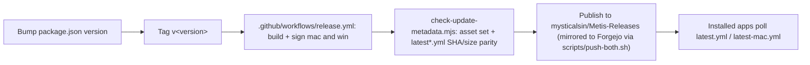

# Platform & dispatch map

One repository ships three distinct products. This is the single place that answers "where do I fix X,
and how does the fix reach users?" so a change is easy to locate and easy to dispatch.

There is **no per-OS fork of the Electron source** — Windows and macOS share `src/**` and differ only by
runtime checks and per-platform packaging overlays. The Swift app under `native-app/` is a separate
product with its own distribution.

---

## 1. Métis for Windows — Electron `.exe`

- **Build config:** `electron-builder.win.yml` (extends `electron-builder.yml`). The Cahê pilot is
  `electron-builder.cahe.win.yml` — a separate `appId` (`com.mantu.metis.windows-cahe`) with **no shared
  update feed**.
- **Artifacts:** NSIS installer `Metis-Setup-<v>.exe`, `Metis-Portable-<v>.exe`, and APPX (Store, built
  into `release-appx/`).
- **Windows-only code / resources:** `src/main/win-security.ts` (managed-config ACL trust), DPAPI-backed
  keystore, the PowerShell foreground watcher, `resources/llama/win`, and the win `sharp`/sherpa native
  packages. Runtime branch points use `isWindows` / `process.platform === 'win32'`.
- **Build scripts (`package.json`):** `dist:win`, `release:build:win`, `predist:win`, `installers:win`,
  `installers:win:cahe`.
- **Dispatch / auto-update:** `release/latest.yml` → `electron-updater` (NSIS). Portable + APPX/Store do
  not auto-update via this feed.

## 2. Métis for macOS — Electron `.dmg`

- **Build config:** `electron-builder.yml` (mac section). Universal (arm64 + x64), with V8 bytecode
  **OFF** for the universal build (`ASKTOTO_MAC_UNIVERSAL=1`; see BUG-LEDGER MQA-207 / MQA-240).
- **macOS-only code / resources:** `native/mac-helper/` (the shipped Swift sidecar: `watch-frontmost`,
  `ocr`, `transcribe`) → `resources/mac-helper`; `resources/llama/mac`; ScreenCaptureKit loopback +
  Apple Speech paths. Runtime branch points use `process.platform === 'darwin'`.
- **Build scripts:** `dist`, `dist:local`, `release:build:mac`, `release:mas` (Mac App Store),
  `installers:mac`.
- **Dispatch / auto-update:** `release/latest-mac.yml` (`.zip` / `.dmg`) → `electron-updater`. MAS uses
  the App Store, not this feed.

## 3. Métis Native for macOS — Swift / SwiftUI

- **Location:** `native-app/` — `App/` (SwiftUI shell) + `MetisKit/` (Swift package with the tested
  logic). Separate product, `appId com.mantu.metis.native`; Apple Intelligence (Foundation Models), App
  Intents, SwiftData. **Not** an Electron conversion.
- **Build / test:** `xcodegen generate` (`native-app/project.yml`) → Xcode; the core builds and tests via
  `swift build` / `swift test` (runs on Linux/CI too, since Apple-only frameworks are `canImport`-guarded).
- **Dispatch / auto-update:** App Store — deliberately **not** `latest-mac.yml` / `electron-updater`.

## Shared across the Electron products

`src/main` (the trust boundary), `src/preload`, `src/renderer`, `src/shared`. Platform differences are
runtime checks, never separate source trees. Orthogonal services that are **not** part of any app build:
`intelligence/` (dashboard bundle), `cloudflare-proxy/` (the Worker), `license-server/` (standalone Node
service).

---

## How a fix gets dispatched

### Electron (Windows + macOS DMG, released together)

- The public **update feed** is the `mysticalsin/Metis-Releases` GitHub repo (the "update folder"), not a
  tracked `release/` directory — `release/` is gitignored build output.
- Enterprise fleets can point at a private generic feed via managed-config `updateFeedUrl`.

### Native macOS (Swift)

Separate App Store submission from `native-app/`. Does not use the `Metis-Releases` feeds.

---

## Quick "where do I fix it?" index

- Windows-only bug → `electron-builder.win.yml`, `src/main/win-security.ts`, win branches in `src/main/**`.
- macOS(Electron)-only bug → `electron-builder.yml` mac section, `native/mac-helper/**`, darwin branches.
- Cross-platform Electron bug → `src/main/**`, `src/renderer/**`, `src/shared/**`.
- Native macOS app → `native-app/App/**` (UI) or `native-app/MetisKit/**` (logic).
- "How does it ship" → bump version + tag; CI publishes to `Metis-Releases`; clients poll `latest*.yml`.
