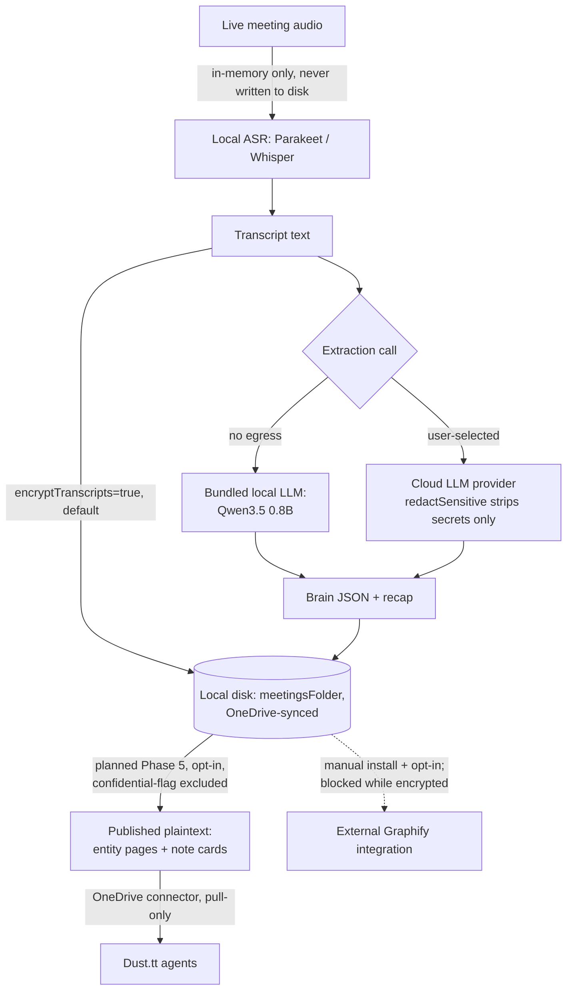

DRAFT — for DPO review, not yet adopted. Prepared 2026-07-11.

# AskToto / Métis — Data Flow One-Pager (the trust story)

Related: [`dpia.md`](./dpia.md) §4 (full risk-mapped data flow), [`tenant-checklist.md`](./tenant-checklist.md).

## What never leaves the device

- **Raw meeting audio.** Captured via the OS mic/system-audio APIs, held only as an in-memory audio buffer
  during live transcription, and discarded once transcribed. No audio file is ever written by the app in
  the live-capture path (verified in code — no audio-file write exists in
  `src/renderer/src/lib/listen.ts`). An imported audio file (a user-picked recording, e.g. from Teams) is
  read from wherever the user already has it and decoded for transcription; the app does not copy that
  source file into its own storage.
- **Speech-to-text.** Both ASR engines run on-device: **Parakeet** (NVIDIA NeMo TDT 0.6B v3, int8-quantized,
  via `sherpa-onnx`) is the default; **Whisper-base** (Xenova ONNX, quantized, via WASM) is the automatic
  fallback. Neither sends audio to a network endpoint to transcribe.
- **Local LLM summarization/extraction (when selected).** The macOS arm64 and Windows x64 packages
  include Qwen3.5 0.8B (quantized GGUF plus its multimodal projector) and the pinned llama.cpp
  `llama-server` b9957 sidecar. They provide a no-cloud-egress path for supported text and visual-input
  tasks. The installed app does not download a model or inference runtime. Local inference remains an
  opt-in provider rather than the default.

## What lands in the Mantu tenant (OneDrive)

- **Transcript text and the derived "brain" record** (accounts/people/deals/commitments extracted from
  meetings), written as JSON + markdown under `<meetingsFolder>` — which defaults to a `Métis Meetings`
  folder inside the user's detected OneDrive sync root, or the local Documents folder if no OneDrive is
  detected (user-overridable path).
- **Encrypted at rest by default** (`encryptTranscripts`, default `true`): AES-GCM, `ATKENC2` format, key
  wrapped by the OS keychain (`safeStorage`) where available. The key is **device-bound** — there is no
  cross-device recovery mechanism today (flagged as the top residual risk in [`dpia.md`](./dpia.md) R4).
- **If a cloud LLM provider is configured** (Settings → provider), a copy of the relevant transcript
  excerpt/prompt is sent to that provider's API for the summarization/extraction call. `redactSensitive`
  (default `true`) strips high-confidence secret patterns (card numbers, SSNs, API keys, private keys)
  from that copy — it does **not** strip participant names, company names, or deal content. The on-disk
  transcript always keeps the unredacted original.

## Optional external Graphify integration

Graphify is not part of the Métis package and is never installed automatically. The status and rebuild
controls are available only for a user who separately installs Python and `graphifyy`, then explicitly
enables the integration. Métis continues to work without it. Graphify's own backend configuration can
affect whether its processing stays local, so it is not counted as part of the packaged offline path.

## Exactly which folders Dust reads

- **Today:** Dust can be used as a Q&A provider (asking questions over the corpus through the app's own
  provider routing) — this is an existing feature, not folder access.
- **Planned — Phase 5, not yet built:** once `publishBrainPages` is enabled (default follows
  `!encryptTranscripts`; enabling it under encryption is an explicit, audit-logged user action), Dust's
  Microsoft OneDrive connector will be able to read:
  - `<meetingsFolder>/entities/{accounts,people,deals}/<id>.md` — derived entity pages (current facts,
    timeline, changelog), never verbatim transcript.
  - `<meetingsFolder>/entities/index.md` and per-directory index files — navigation.
  - Per-meeting **note cards** — recap-derived, minimized summaries, explicitly not the raw transcript.
  - `<meetingsFolder>/_schema/AGENTS.md` — the agent-facing schema contract.
  - Meetings flagged **confidential** (a per-meeting toggle, planned Phase 5) are excluded from all of the
    above.
- **Dust never reads:** raw audio (none exists), the verbatim transcript files, or anything while
  `publishBrainPages` is off — which is the current, default-adjacent state today given
  `encryptTranscripts` defaults on and `graphify.ts` already refuses to run over an encrypted folder
  (confirmed at `graphify.ts:227`), meaning the corpus is not plaintext-readable by Dust or the
  optional, manually installed Graphify integration under today's defaults.

## Model provenance

| Function | Model | Where it runs | Notes |
|---|---|---|---|
| ASR (default) | Parakeet TDT 0.6B v3 (NVIDIA NeMo), int8 | On-device, via `sherpa-onnx` | 25 European languages, auto-detect |
| ASR (fallback) | Whisper-base (Xenova, ONNX, quantized) | On-device, via WASM in the renderer | Automatic fallback if Parakeet is unavailable |
| Text summarization/extraction (local option) | Qwen3.5 0.8B (UD-Q4_K_XL GGUF + mmproj-F16) | On-device, via bundled llama.cpp `llama-server` b9957 | Bundled in macOS arm64 and Windows x64 packages; no runtime download |
| Text summarization/extraction (cloud option) | User-selected: Claude (Anthropic), GPT (OpenAI), or one of 12 other providers | Provider's cloud infrastructure | Per-user Settings choice; see [`dpia.md`](./dpia.md) R2 for the transfer implications |
| Vision (local option) | Qwen3.5 0.8B + mmproj-F16 | On-device, via bundled llama.cpp `llama-server` b9957 | Uses the same installer-owned payload for supported screenshot requests; no runtime download |

## Diagram

